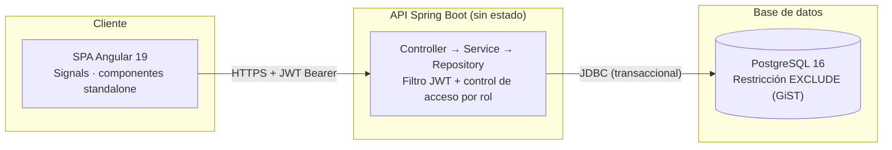
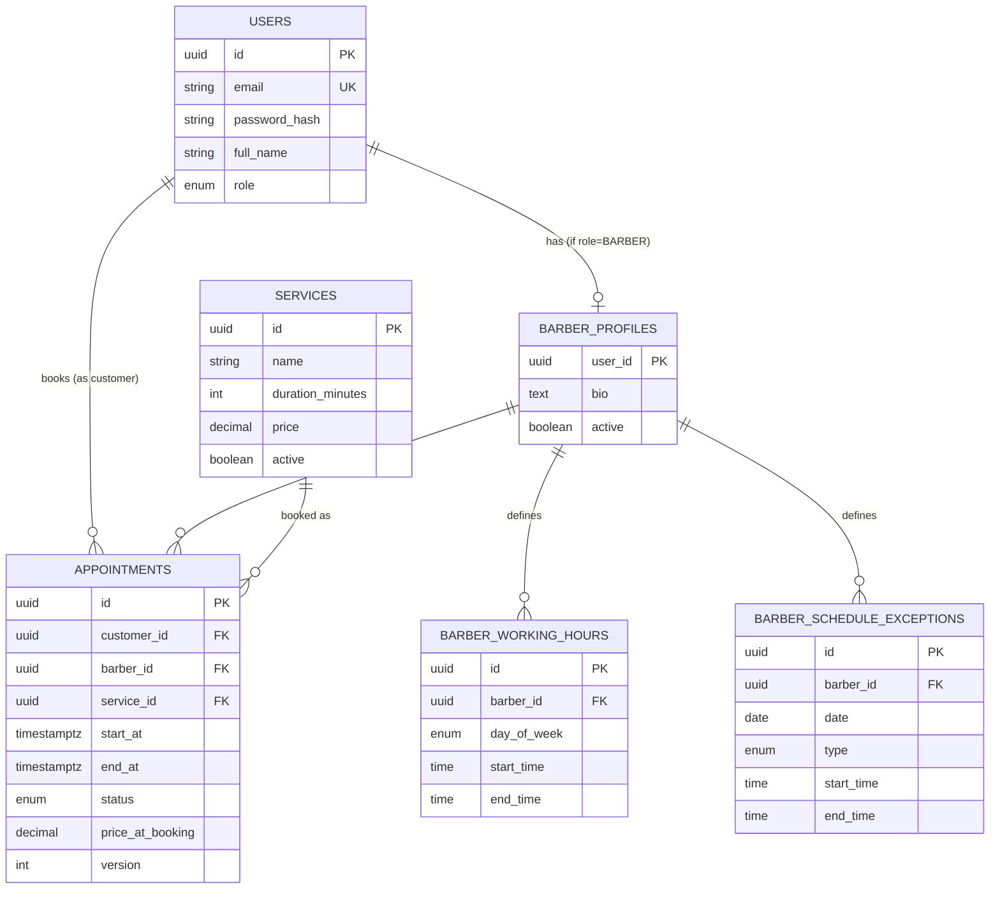

# Barber Booking System

[](https://github.com/lgddani/barber-booking-system/actions/workflows/backend-ci.yml)
[](https://github.com/lgddani/barber-booking-system/actions/workflows/frontend-ci.yml)

Un sistema de reservas full-stack para una barbería — tres roles (cliente, barbero, administrador), un motor de disponibilidad consciente de la duración de cada servicio, y una garantía a nivel de base de datos de que dos clientes nunca pueden reservar el mismo horario con el mismo barbero, incluso bajo concurrencia real.

Está construido para demostrar profundidad de ingeniería backend, no solo CRUD: la protección contra doble-reserva vive en PostgreSQL mismo (una restricción de exclusión GiST), no en el código de la aplicación, así que se mantiene sin importar cuántas instancias del backend estén corriendo o por dónde llegue la petición.

## Tabla de contenidos

- [Demo](#demo)
- [Funcionalidades principales](#funcionalidades-principales)
- [Stack técnico](#stack-técnico)
- [Arquitectura](#arquitectura)
- [Modelo de datos y la garantía anti-doble-reserva](#modelo-de-datos-y-la-garantía-anti-doble-reserva)
- [Cómo correrlo](#cómo-correrlo)
- [Cómo correr los tests](#cómo-correr-los-tests)
- [Desafíos técnicos](#desafíos-técnicos)
- [Notas de ingeniería](#notas-de-ingeniería)
- [Estructura del proyecto](#estructura-del-proyecto)

## Demo

**[Video demostrativo — link próximamente]**

No hay una demo desplegada en vivo. Los planes gratuitos de hosting para el backend (Render, Railway, etc.) "duermen" la API tras un rato de inactividad, así que el primer clic de alguien revisando el proyecto se encontraría con 30-50 segundos de carga fría — peor primera impresión que no tener demo en vivo. En su lugar: un video grabado arriba, y una puesta en marcha local a un solo comando de distancia (ver [Cómo correrlo](#cómo-correrlo)) — son las mismas imágenes de Docker que el CI ya valida en cada cambio, no una versión reducida para la demo.

## Funcionalidades principales

**Cliente**
- Registro / inicio de sesión (JWT, sin estado)
- Explorar servicios y barberos
- Grilla de disponibilidad en tiempo real — considera el horario semanal del barbero, sus excepciones puntuales, y la duración exacta del servicio elegido
- Reservar una cita; manejo claro si alguien más se adelanta y toma ese horario
- Ver y cancelar sus propias citas

**Barbero**
- Su propia agenda diaria — marcar citas como completadas / no-show / canceladas
- Editor de horario semanal, incluyendo turnos partidos (ej. 9-13 y 14-18)
- Excepciones de horario — bloquear una fecha puntual, o darle un horario distinto al habitual

**Administrador**
- CRUD completo de servicios y barberos (solo baja lógica — desactivar, nunca borrar, para que las citas históricas conserven su integridad referencial)
- Editar el horario/excepciones de *cualquier* barbero directamente, sin cambiar de cuenta
- Todas las citas del negocio — con búsqueda y filtro por estado
- Estadísticas del negocio para cualquier rango de fechas: total de reservas, ingresos de citas completadas, desglose por estado, barbero más solicitado

## Stack técnico

**Backend** — Java 21 · Spring Boot 4.1 (Spring Framework 7) · Spring Security (JWT sin estado, `@PreAuthorize` a nivel de método) · Spring Data JPA · Flyway · PostgreSQL 16 · springdoc-openapi (Swagger UI) · Maven

**Frontend** — Angular 19 (componentes standalone, Signals, sin NgRx) · Angular Material 3 · Tailwind CSS v4 · TypeScript · RxJS

**Testing** — JUnit 5 + Mockito (unitarios) · Testcontainers (integración, PostgreSQL real) · 46 tests de backend en total, incluida una prueba de concurrencia con 15 hilos

**Infraestructura** — Docker (builds multi-etapa) · Docker Compose · nginx (hosting estático + proxy inverso) · GitHub Actions (CI en cada push)

## Arquitectura



- **Autenticación sin estado** (JWT, sin sesiones en el servidor) — cualquier cantidad de instancias del backend puede atender peticiones indistintamente, sin necesitar un almacén de sesiones compartido.
- La invariante "no hay citas solapadas" vive **en la base de datos**, no en la capa de servicio — así que se mantiene sin importar cuántas instancias del backend existan o por dónde llegue la petición.
- Los virtual threads (`spring.threads.virtual.enabled=true`) están habilitados como una característica de Java 21, aunque la corrección bajo concurrencia viene de la restricción de la base de datos, no de esto.

## Modelo de datos y la garantía anti-doble-reserva



`role` es `CUSTOMER | BARBER | ADMIN`; `barber_schedule_exceptions.type` es `CLOSED | CUSTOM_HOURS` (esta última *reemplaza* el horario habitual de ese día, en vez de sumarse a él); `appointments.version` es una columna de bloqueo optimista, que resuelve la carrera entre "el barbero marca completada" y "el cliente cancela" en el mismo instante.

La pieza central está en `appointments`. Una columna generada `tstzrange` más dos restricciones `EXCLUDE USING gist`:

```sql
CREATE EXTENSION IF NOT EXISTS btree_gist;

ALTER TABLE appointments
  ADD CONSTRAINT no_overlap_per_barber
  EXCLUDE USING gist (barber_id WITH =, slot WITH &&)
  WHERE (status NOT IN ('CANCELLED', 'NO_SHOW'));

ALTER TABLE appointments
  ADD CONSTRAINT no_overlap_per_customer
  EXCLUDE USING gist (customer_id WITH =, slot WITH &&)
  WHERE (status NOT IN ('CANCELLED', 'NO_SHOW'));
```

Si dos peticiones intentan reservar al mismo barbero en un horario que se solapa, PostgreSQL deja pasar exactamente un `INSERT` y rechaza el otro con una violación de restricción — de forma atómica, sin ningún bloqueo explícito en el código de la aplicación, y correcto sin importar cuántas instancias del backend estén corriendo. El mismo mecanismo garantiza, por separado, que un cliente no pueda terminar con dos citas simultáneas con dos barberos distintos.

Bajo alta concurrencia esto puede aparecer como una violación de exclusión limpia (`23P01`) o, en ocasiones, como un deadlock (`40P01`) cuando muchas transacciones compiten por el mismo rango a la vez — ambos casos se capturan y se traducen al mismo `409 Conflict`. Este caso límite solo apareció al correr la prueba de concurrencia con 15 hilos reales, no con un puñado de peticiones manuales; ver [Desafíos técnicos](#desafíos-técnicos).

## Cómo correrlo

Solo necesitas [Docker](https://www.docker.com/) — no hace falta instalar Java, Node ni Postgres localmente.

```bash
git clone https://github.com/lgddani/barber-booking-system.git
cd barber-booking-system
docker compose up --build -d
```

La primera vez construye ambas imágenes (un par de minutos); después de eso, segundos. Una vez arriba:

| | URL |
|---|---|
| Aplicación | http://localhost:8081 |
| API / Swagger UI | http://localhost:8080/swagger-ui.html |

La base de datos se siembra sola con datos de demo en el primer arranque:

| Rol | Correo | Contraseña |
|---|---|---|
| Administrador | `admin@barberbooking.dev` | `admin123` |
| Barbero | `carlos@barberbooking.dev` | `barbero123` |
| Cliente | `cliente1@barberbooking.dev` | `cliente123` |

Para apagar todo: `docker compose stop` (conserva las imágenes, y el volumen de datos persiste); `docker compose down` quita los contenedores pero el volumen de datos igual sobrevive.

## Cómo correr los tests

```bash
cd backend
./mvnw test      # 26 tests unitarios — rápido, no necesita Docker
./mvnw verify    # + 20 tests de integración (Postgres real vía Testcontainers,
                 #   incluida la prueba de concurrencia con 15 hilos) — necesita Docker corriendo
```

`mvn verify` es también lo que corre en CI en cada push (ver los badges arriba) — se levanta un contenedor de Postgres real en cada corrida, no uno simulado.

## Desafíos técnicos

**1. Reservas seguras bajo concurrencia.** El enfoque obvio es un bloqueo a nivel de aplicación o un `SELECT ... FOR UPDATE` de verificar-y-luego-insertar. Ambos funcionan — hasta que hay más de una instancia del backend, momento en el que la garantía deja de sostenerse silenciosamente. La restricción `EXCLUDE` traslada la invariante al único lugar que es autoritativo sin importar la topología de la aplicación: la base de datos misma. Verificado con una prueba automatizada que dispara 15 hilos contra exactamente el mismo barbero/horario al mismo tiempo, y confirma que sobrevive exactamente una reserva — consultando directamente la base de datos, no solo leyendo los códigos de respuesta HTTP.

**2. El motor de disponibilidad.** Calcular "qué horarios están realmente libres" no es una sola consulta: hay que combinar la plantilla semanal recurrente del barbero con las excepciones de una fecha puntual (un día cerrado, u horas especiales que *reemplazan* el horario habitual, no se suman a él), considerar la duración exacta del servicio pedido, descartar lo que ya está ocupado, y descartar lo que ya pasó si es el mismo día. Es una función pura, lo que la convirtió en la pieza con más cobertura de tests unitarios del proyecto — casos límite como un servicio que por poco no alcanza a caber antes del cierre, o una excepción de horario completamente especial, se prueban directamente.

**3. Seguridad sin estado con reglas de propiedad reales.** Autenticación JWT sin sesión en el servidor, `@PreAuthorize` con expresiones SpEL para propiedad a nivel de fila (por ejemplo, un barbero puede editar su propio horario, o un admin el de cualquiera — `hasRole('ADMIN') or #barberId == authentication.principal.id`), y un endpoint de registro público que ignora silenciosamente cualquier campo `role` en el payload, para que nadie pueda auto-registrarse como administrador.

## Notas de ingeniería

Algunos hallazgos reales que vale la pena mencionar, no solo una lista de funcionalidades:

- **Spring Boot 4 trae Jackson 3 por dentro, sin avisar mucho** (`tools.jackson.*`, no el conocido `com.fasterxml.jackson.*`). Nada en la documentación lo anuncia con suficiente claridad — apareció como un error de compilación de "esta clase no existe" que tomó revisar el árbol real de dependencias para explicar.
- **Se evaluaron y descartaron dos librerías de componentes de Angular de terceros** antes de decidirse por Angular Material: una había dejado de dar soporte a la versión de Angular del proyecto en todas sus versiones estables, la otra solo tenía una línea compatible en versión que requería licencia paga. Angular Material ganó justamente *por* ser de primera parte — siempre gratuita, siempre alineada en versión.
- **El hallazgo del deadlock bajo carga** mencionado arriba: 12 peticiones concurrentes manuales durante pruebas mostraron solo el modo de falla "limpio" (violación de exclusión). Hizo falta una prueba automatizada con 15 hilos para que apareciera la variante de deadlock — un recordatorio de que las pruebas manuales con poca concurrencia pueden no encontrar modos de falla reales que solo aparecen bajo carga real.

## Estructura del proyecto

```
barber-booking-system/
├── backend/    API Spring Boot (Java 21)
├── frontend/   SPA Angular 19
├── .github/workflows/   CI (backend-ci.yml, frontend-ci.yml)
└── docker-compose.yml   db + backend + frontend, un solo comando
```
